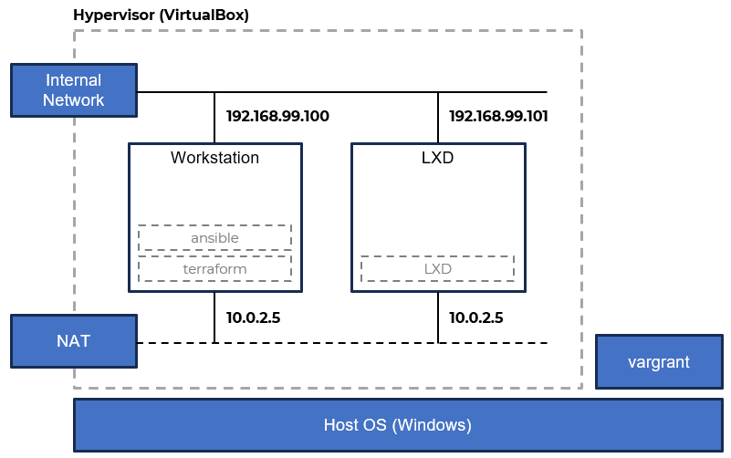

# LXD + Terraform + Ansible

A short demo for the students of my **DevOps: Containerization &amp; Infrastructure** course that I teach at **SoftUni**.

## Supporting files

The demonstration steps are [here](DEMO.md)

And the **Vagrantfile** to prepare the environment is [here](Vagrantfile)

There is a recorded vide as well. You can find it [here](https://youtu.be/6e_wPocaWK4)

## Requirements

A station with installed:

- VirtualBox
- vagrant

## Infrastructure

For the demo we will create and use the following:

## Need training?

Feel free to contact [me](https://www.linkedin.com/in/dzahariev/) if you or the company you work for needs training on this or related topics.
